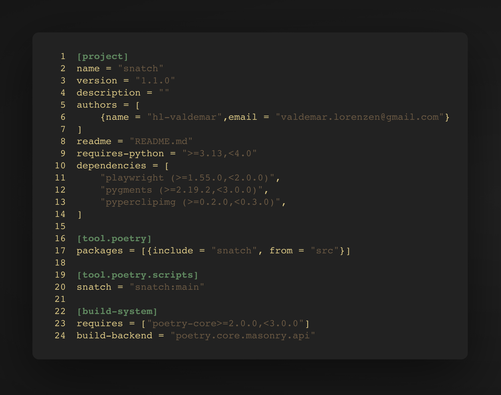

# SNATCH ✨

Generate presentable code images from the command line.



**Commands**:

```bash
λ snatch --help
usage: snatch [-h] [-f FILE] [-o OUTPUT] [-l LANGUAGE] [-t THEME] [--list-themes]
              [--font-size FONT_SIZE] [-p PADDING] [-m MARGIN] [-c] [--no-line-numbers]
              [--no-chrome] [--no-decorations] [--list-examples]

Generate presentable images of code snippets

options:
  -h, --help            show this help message and exit
  -f, --file FILE       Input file (if not using stdin)
  -o, --output OUTPUT   Output file (optional, saves to file if specified)
  -l, --language LANGUAGE
                        Language for syntax highlighting (e.g., python, javascript)
  -t, --theme THEME     Pygments theme name (default: monokai). Use any Pygments style.
  --list-themes         List all available Pygments themes and exit
  --font-size FONT_SIZE
                        Font size in pixels (default: 12)
  -p, --padding PADDING
                        Padding inside window in pixels (default: 20)
  -m, --margin MARGIN   Margin around window in pixels (default: 40)
  -c, --clipboard       Copy image to clipboard after generation
  --no-line-numbers     Hide line numbers
  --no-chrome           Hide window chrome
  --no-decorations      Hide window deocrations
  --list-examples       Get a list of examples

Examples:
  # From stdin (pipe) - auto-detect language
  cat script.py | snatch -o output.png

  # From file - language detected from extension
  snatch -f script.py -o output.png

  # To clipboard - no write to file
  snatch -f script.py -c

  # To clipboard - also write to file
  snatch -f script.py -c -o output.png

  # Explicit language and theme
  echo 'print("hello")' | snatch -l python -t monokai -o hello.png

  # With custom settings
  cat code.js | snatch -t dracula --font-size 16 -m 80 -o code.png

  # No line numbers or window chrome
  snatch -f code.py --no-line-numbers --no-chrome -o code.png

  # List all available themes
  snatch --list-themes

Popular themes: monokai, dracula, github-dark, nord, solarized-dark,
                one-dark, material, gruvbox-dark, zenburn, paraiso-dark
```

**Installation**:

```bash
git clone https://github.com/hl-valdemar/snatch
cd snatch
poetry install
pipx install .
```

Note: requires `poetry` and `pipx`.
